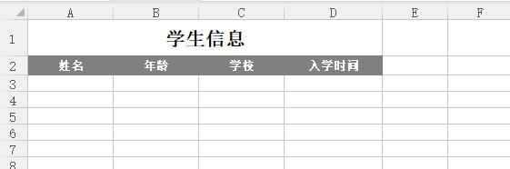
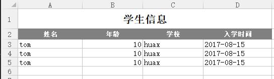
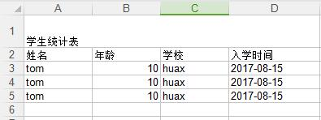
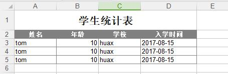

# exportExcel
Excel tools，对excel封装让excel导出更简单！
###### (项目测试范例请参考，test包下的 ExcelTest测试用例) 
 1、 新建excel导出。

``` java
Excel excel = new Excel(); //新建excel
ExcelSheet sheet = excel.createSheet(); //新建sheet
sheet.row(0).cell(2).cellValue("1");    //调用cellValue()，设置excel样式
sheet.row(1).cell(2).cellValue("2");
excel.saveExcel("c://test1.xlsx");      //存储excel
```

 2、 调用模板导出。

``` java
Excel excel = new Excel("c://test1.xlsx");
ExcelSheet sheet = excel.getSheet();         //默认获取第一个工作簿
sheet.row(0).cell(2).cellValue("111111111"); //设置excel value值
excel.saveExcel("c://test2.xlsx");
```

3、 entity list通过注解导出。

###### Student 实体类
``` java
/**
 * 学生 excel测试
 */
public class Student {
    private static final long serialVersionUID = -4026917215285783232L;
    @ExcelField(title = "姓名",sort = 1)
    private String name;
    @ExcelField(title = "学校" ,sort = 3)
    private String school;
    @ExcelField(title = "年龄",sort=2)
    private Integer age;
    @ExcelField(title = "入学时间",sort = 4)
    private Date joinDate;
    public Student() {}
    //set/get 方法省略。
    .....
}
``` 
###### 数据初始化
``` java
/**
 * 初始化数据
 * @return
 */
static List<Student>  init(){
    List<Student> list = new ArrayList<>();
    Student st1 = new Student("tom","huax",10);
    Student st2 = new Student("tom","huax",10);
    Student st3 = new Student("tom","huax",10);
    list.add(st1);
    list.add(st2);
    list.add(st3);
    //list.forEach(s->System.out.println(s));
    return list;
}
```
###### 调用excel导出方法，对list数据循环导出。
``` java
/**
 * 模板指定位置 list数据循环导出（需要entity注解）
 * @throws IOException
 * @throws NoSuchMethodException
 * @throws IllegalAccessException
 * @throws InvocationTargetException
 */
@Test
public void myExcel() throws IOException, NoSuchMethodException, IllegalAccessException, InvocationTargetException {
    Excel excel = new Excel("c://student_temp.xls");
    ExcelSheet sheet = excel.getSheet();
    sheet.setDateList(init(), 2, 0);  //此处2,0位置为row,cell起始位置
    excel.saveExcel("c://student_temp_rs.xlsx");
}
``` 
###### 模板

###### 导出的数据


4.基于注解导出excel
###### 注解导出（无样式）
``` java
Excel excel = new Excel();
ExcelSheet sheet = excel.createSheet();
sheet.title("学生统计表"); //设置excel title名称(可不设)
sheet.header(Student.class).setData(init()); //设置 data
excel.saveExcel("c://student_annotation.xlsx");
``` 
##### 效果


###### 注解导出（自定义样式）
``` java
Excel excel = new Excel();
ExcelSheet sheet = excel.createSheet();
//获取excel样式
Map<String, CellStyle> styles = createStyles(excel.getWorkbook());
sheet.title("学生统计表").cellStyle(styles.get("title"));    //设置title 以及样式
sheet.header(Student.class, styles.get("header"))           //设置hear 以及样式
        .setData(init()).cellStyle(styles.get("data"));     //设置data 样式
excel.saveExcel("c://student_annotation.xlsx");
``` 
##### 效果



5.excel导入 (测试导入上图内容)
##### 直接将excel内容导入到 List对象中
``` java
Excel excel = new Excel("c://student_annotation.xlsx");
ExcelSheet sheet = excel.getSheet();
List<Map<String, String>> list = sheet.getList(1, 0).toMap(); //1,0(为起始位置，从header开始算起)核心方法
list.forEach(map -> System.out.println(map));
```
###### 打印结果
```html 
{姓名=tom, 年龄=10, 学校=huax, 入学时间=2017-08-15}
{姓名=tom, 年龄=10, 学校=huax, 入学时间=2017-08-15}
{姓名=tom, 年龄=10, 学校=huax, 入学时间=2017-08-15}
```
##### 考虑到上述数据不是我们所需要的，特此增加注解导出的方法。
``` java
List<Map<String, String>> list = sheet.getList(1, 0).toMap4Annotation(Student.class); 
```
###### 打印结果
```html 
{name=tom, age=10, school=huax, joinDate=2017-08-15}
{name=tom, age=10, school=huax, joinDate=2017-08-15}
{name=tom, age=10, school=huax, joinDate=2017-08-15}
```
##### 有可能注解并不能很实用，在实际开发中，为此增加了自定义的方式（打印结果如上）。
``` java
String keyValue = "姓名:name,学校:school,年龄:age,入学时间:joinDate";
List<Map<String, String>> list = sheet.getList(1, 0,keyValue).toMap();
```

6.excel导入映射至对象 
##### 实际开发中，更为实用的是直接映射到对象里，为此新增了导入对象的方法。
``` java
List<Student> list = sheet.getList(1, 0).toObject(Student.class);
```
##### 同时可自定义导入对象属性中。
``` java
String keyValue = "姓名:name,学校:school,年龄:age,入学时间:joinDate";
List<Student> list = sheet.getList(1, 0,keyValue).toObject(Student.class);
```
###### 打印结果
```html 
Student{name='tom', school='huax', age=10, joinDate=Tue Aug 15 00:00:00 CST 2017}
Student{name='tom', school='huax', age=10, joinDate=Tue Aug 15 00:00:00 CST 2017}
Student{name='tom', school='huax', age=10, joinDate=Tue Aug 15 00:00:00 CST 2017}
```

7.获取单条数据
``` java
String title = sheet.getRow(0).getCell(0).getCellValue(); //根据指定位置获取数据，统一为String
System.out.println(title);
```
###### 打印结果
```html 
学生统计表
```

8.excel导出样式优化，简化单元格样式设置。
``` java
//设置样式
CellStyle cellStyle = ExcelStyle.builder(excel.getWorkbook())
                .align(HSSFCellStyle.ALIGN_CENTER) //设置居中
                .fondFamily("宋体")  //设置字体
                .fondSize((short) 12) //设置字体大小
                .fondWeight((short) 10) //加粗
                .border(ExcelStyle.BORDER_TOP, ExcelStyle.BORDER_LEFT, ExcelStyle.BORDER_BOTTOM, ExcelStyle.BORDER_RIGHT) //设置表格边框
                .build();
```